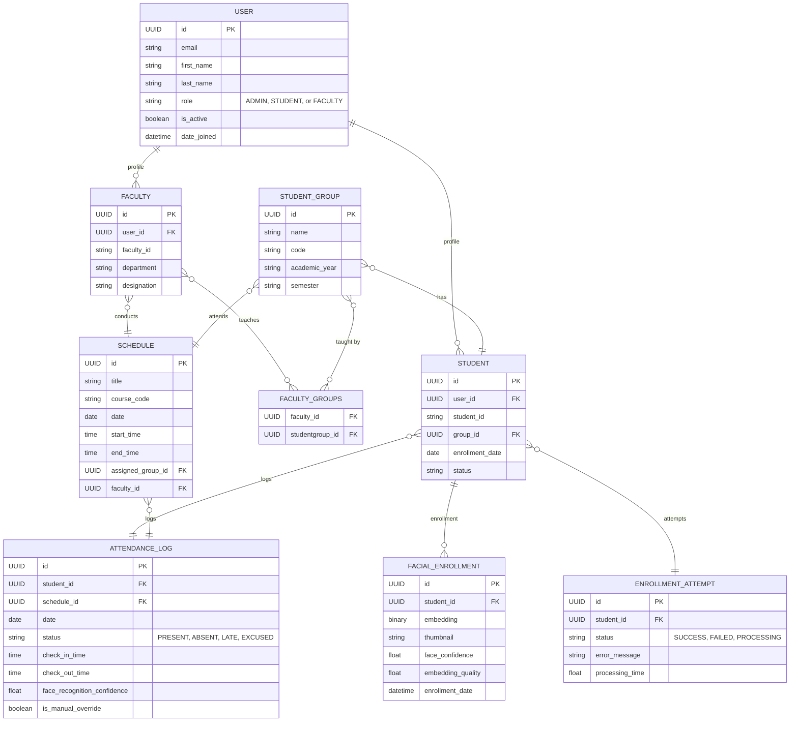

# BioAttend Database Schema

```mermaid
erDiagram
    USER {
        UUID id PK
        string email
        string first_name
        string last_name
        string role "ADMIN, STUDENT, or FACULTY"
        boolean is_active
        datetime date_joined
    }

    STUDENT {
        UUID id PK
        UUID user_id FK
        string student_id
        UUID group_id FK
        date enrollment_date
        string status
    }

    STUDENT_GROUP {
        UUID id PK
        string name
        string code
        string academic_year
        string semester
    }

    FACULTY {
        UUID id PK
        UUID user_id FK
        string faculty_id
        string department
        string designation
    }

    FACULTY_GROUPS {
        UUID faculty_id FK
        UUID studentgroup_id FK
    }

    SCHEDULE {
        UUID id PK
        string title
        string course_code
        date date
        time start_time
        time end_time
        UUID assigned_group_id FK
        UUID faculty_id FK
    }

    ATTENDANCE_LOG {
        UUID id PK
        UUID student_id FK
        UUID schedule_id FK
        date date
        string status "PRESENT, ABSENT, LATE, EXCUSED"
        time check_in_time
        time check_out_time
        float face_recognition_confidence
        boolean is_manual_override
    }

    FACIAL_ENROLLMENT {
        UUID id PK
        UUID student_id FK
        binary embedding
        string thumbnail
        float face_confidence
        float embedding_quality
        datetime enrollment_date
    }

    ENROLLMENT_ATTEMPT {
        UUID id PK
        UUID student_id FK
        string status "SUCCESS, FAILED, PROCESSING"
        string error_message
        float processing_time
    }

    USER ||--o{ STUDENT : "profile"
    USER ||--o{ FACULTY : "profile"

    STUDENT_GROUP }o--|| STUDENT : "has"
    STUDENT }o--|| ATTENDANCE_LOG : "logs"
    STUDENT ||--o{ FACIAL_ENROLLMENT : "enrollment"
    STUDENT }o--|| ENROLLMENT_ATTEMPT : "attempts"

    FACULTY }o--o{ FACULTY_GROUPS : "teaches"
    STUDENT_GROUP }o--o{ FACULTY_GROUPS : "taught by"

    FACULTY }o--|| SCHEDULE : "conducts"
    STUDENT_GROUP }o--|| SCHEDULE : "attends"

    SCHEDULE }o--|| ATTENDANCE_LOG : "logs"

```
