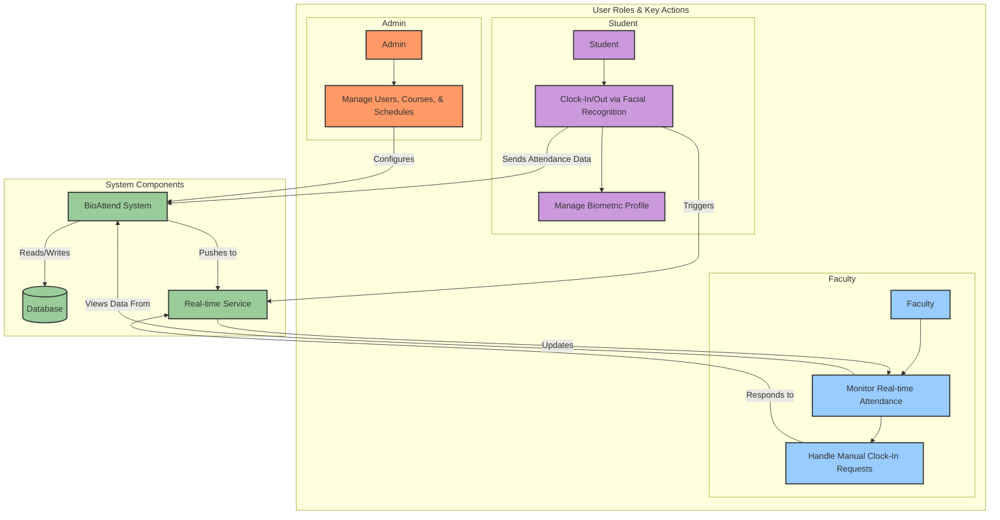

# BioAttend Moderately Detailed Workflow

This flowchart provides a balanced overview of the user workflows, adding key actions for each role to show how they interact with the BioAttend system without excessive detail.

## Moderately Detailed Workflow Diagram

### Key Interaction Points

-   **Admin**: Primarily responsible for the initial setup and ongoing management of the system's core data (users, courses, schedules).
-   **Student**: The primary action is clocking in and out. This involves interacting with the facial recognition system and managing their own biometric data.
-   **Faculty**: Focuses on monitoring the attendance of their assigned schedules in real-time and managing exceptions, such as manual clock-in requests.
-   **System Components**: The **BioAttend System** processes all requests, the **Database** stores all persistent data, and the **Real-time Service** (Pusher) handles live notifications between students and faculty.
