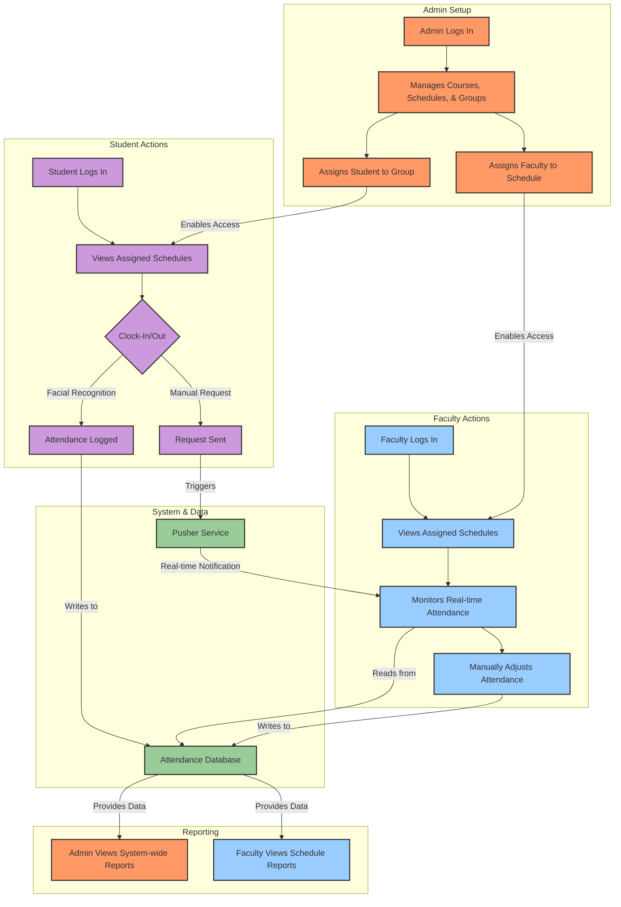

# BioAttend Merged User Workflow

This flowchart provides a unified view of how the Student, Faculty, and Admin workflows interconnect within the BioAttend system, highlighting key points of interaction.

## Unified Workflow Diagram

### Workflow Explanation

1.  **Setup (Admin)**: The Admin is responsible for the initial setup, including creating courses, schedules, and student groups. They assign faculty to schedules and students to groups, which grants them access to the relevant parts of the system.
2.  **Attendance (Student)**: The Student logs in and can only see the schedules they are assigned to. They can then clock in or out using facial recognition or request a manual clock-in.
3.  **Monitoring (Faculty)**: The Faculty member logs in to view the schedules they are assigned to. They can monitor attendance in real-time. When a student sends a manual clock-in request, the faculty receives a real-time notification to approve or dismiss it.
4.  **Data Flow**: All attendance events are recorded in the central **Attendance Database**. Real-time events are pushed through the **Pusher Service**.
5.  **Reporting**: Both Admins and Faculty can view attendance reports. Admins have access to system-wide data, while Faculty can view reports for the specific schedules they manage.
