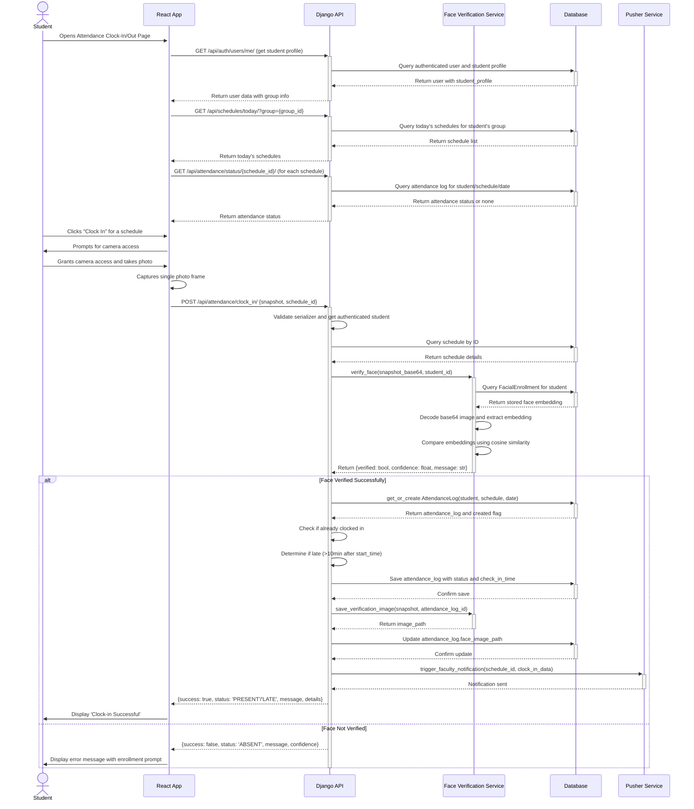
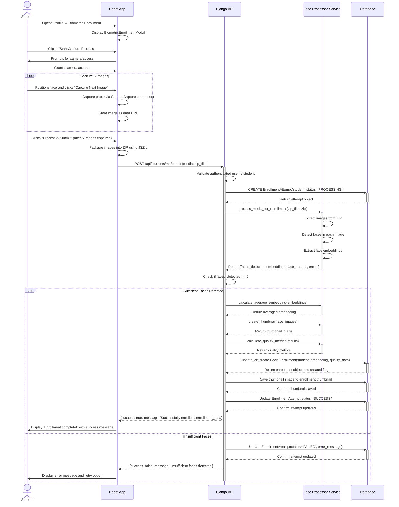
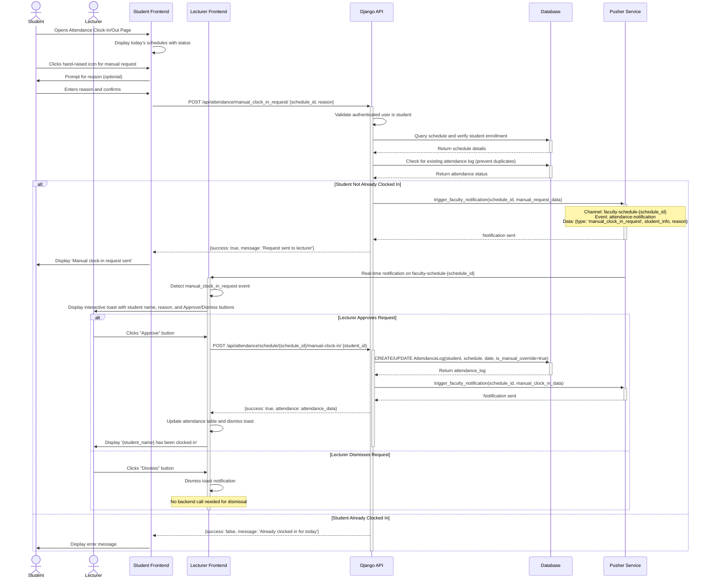

# Sequence Diagrams

This document contains sequence diagrams for key user activities in the BioAttend system.

## 1. Student Attendance Clock-In

This diagram illustrates the process of a student clocking in for a scheduled class using facial recognition.

## 2. Student Facial Enrollment (Self-Enrollment)

This diagram shows the sequence for a student enrolling their own facial data through the biometric enrollment modal.

## 3. Manual Clock-In Request

This diagram shows the sequence when a student requests manual clock-in and the lecturer receives a real-time notification to approve or dismiss the request.

