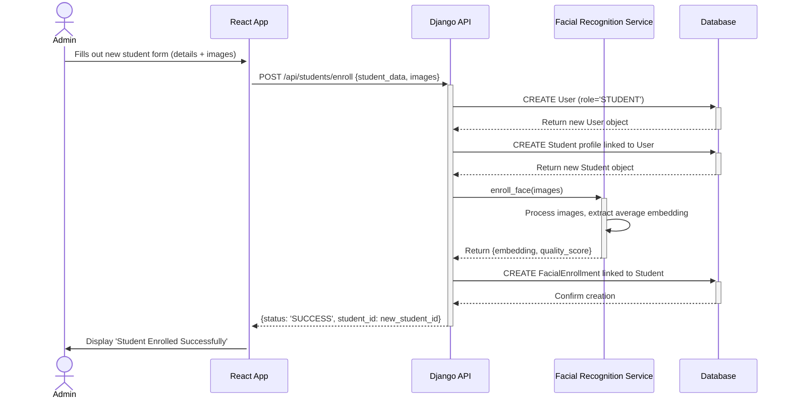

# Sequence Diagrams

This document contains sequence diagrams for key user activities in the BioAttend system.

## 1. Student Attendance Clock-In

This diagram illustrates the process of a student clocking in for a scheduled class using facial recognition.

```mermaid
sequenceDiagram
    actor Student
    participant Frontend as React App
    participant Backend as Django API
    participant FaceRec as Facial Recognition Service
    participant DB as Database

    Student->>+Frontend: Opens Attendance Page for a Schedule
    Frontend->>+Backend: GET /api/schedules/:id/details
    Backend->>+DB: Query for schedule and student list
    DB-->>-Backend: Return schedule details
    Backend-->>-Frontend: Return schedule and enrollment data

    Frontend->>Student: Prompts for camera access
    Student->>Frontend: Grants camera access
    Frontend->>Frontend: Activates camera and captures video frame

    loop Real-time Face Verification
        Frontend->>+Backend: POST /api/attendance/clock-in {frame, schedule_id}
        Backend->>+FaceRec: verify_face(frame, enrolled_student_ids)
        FaceRec->>FaceRec: Detect face & extract embedding
        FaceRec->>FaceRec: Compare with stored embeddings
        FaceRec-->>-Backend: Return match {student_id, confidence}

        alt Match Found and Confidence > Threshold
            Backend->>+DB: CREATE AttendanceLog entry
            DB-->>-Backend: Confirm creation
            Backend-->>-Frontend: {status: 'SUCCESS', student: student_details}
            Frontend->>Student: Display 'Clock-in Successful'
            break
        else No Match or Low Confidence
            Backend-->>-Frontend: {status: 'FAILED', reason: 'No match found'}
            Frontend->>Student: Display 'Face not recognized, please try again'
        end
    end

```

## 2. Admin Enrolls a New Student

This diagram shows the sequence for an administrator enrolling a new student, including capturing their facial data.


