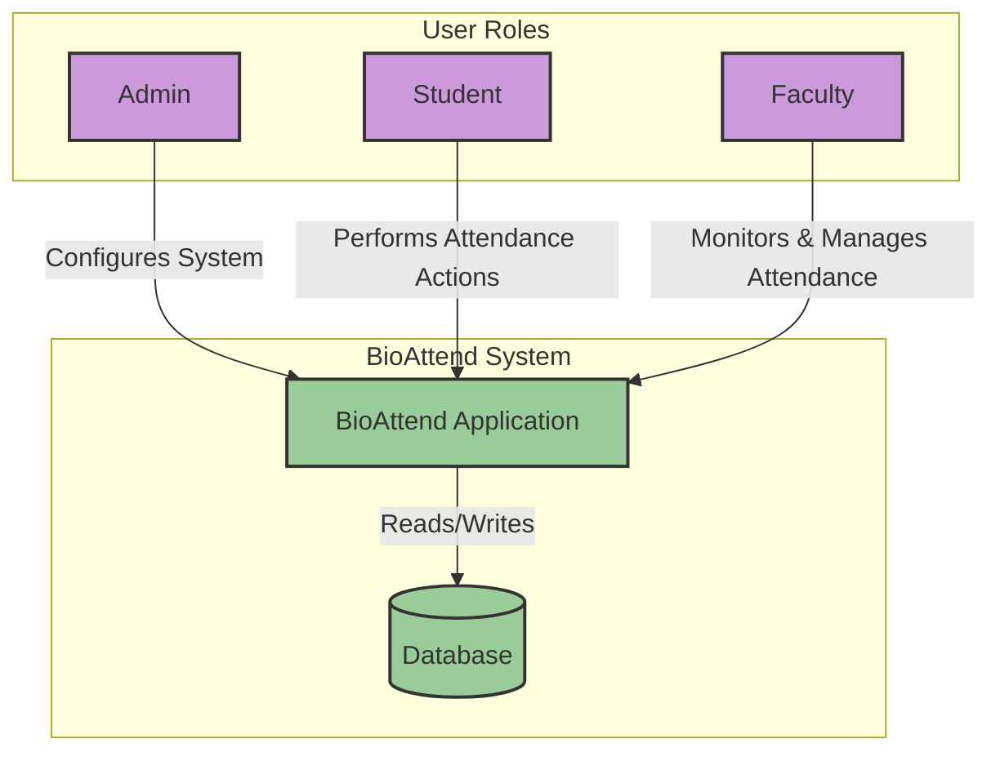

# BioAttend Simplified Merged Workflow

This flowchart provides a simplified, high-level overview of the core interactions between user roles and the BioAttend system.

## Simplified Workflow Diagram

### Core Interactions

1.  **Admin**: Sets up and configures the system (e.g., creates users, schedules, and courses).
2.  **Student**: Interacts with the system primarily to perform attendance actions (e.g., clock-in/out).
3.  **Faculty**: Uses the system to monitor and manage student attendance for their assigned schedules.
4.  **BioAttend System & Database**: All user roles interact with the central **BioAttend Application**, which processes all logic and reads from or writes to the **Database**.
