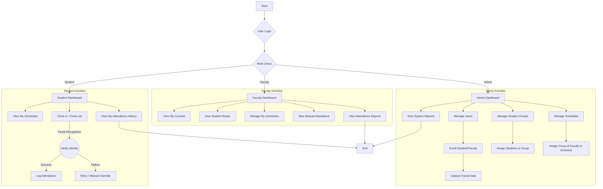

# User Activity Diagram

This diagram illustrates the primary activities and workflows for the different user roles within the BioAttend system.

```mermaid
graph TD
    A[Start] --> B{User Login};
    B --> C{Role Check};

    C -- Admin --> D[Admin Dashboard];
    C -- Faculty --> E[Faculty Dashboard];
    C -- Student --> F[Student Dashboard];

    subgraph Admin Activities
        D --> D1[Manage Users];
        D --> D2[Manage Student Groups];
        D --> D3[Manage Schedules];
        D --> D4[View System Reports];
        D1 --> D1a[Enroll Student/Faculty];
        D1a --> D1b[Capture Facial Data];
        D2 --> D2a[Assign Students to Group];
        D3 --> D3a[Assign Group & Faculty to Schedule];
    end

    subgraph Faculty Activities
        E --> E1[View My Courses];
        E --> E2[View Student Roster];
        E --> E3[Manage My Schedules];
        E --> E4[Take Manual Attendance];
        E --> E5[View Attendance Reports];
    end

    subgraph Student Activities
        F --> F1[View My Schedules];
        F --> F2[Clock-in / Clock-out];
        F --> F3[View My Attendance History];
        F2 -- Facial Recognition --> F2a((Verify Identity));
        F2a -- Success --> F2b[Log Attendance];
        F2a -- Failure --> F2c[Retry / Manual Override];
    end

    D4 --> Z[End];
    E5 --> Z;
    F3 --> Z;

```
