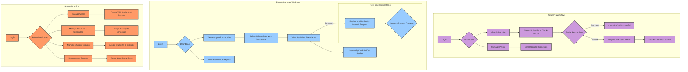

# BioAttend User Interaction Flowchart

This document illustrates the primary workflows and interactions for each user role within the BioAttend system.

## User Workflows

```mermaid
graph TD
    subgraph Student Workflow
        A1[Login] --> A2{Dashboard}
        A2 --> A3[View Schedules]
        A3 --> A4[Select Schedule to Clock-In/Out]
        A4 --> A5{Facial Recognition}
        A5 -- Success --> A6[Clock-In/Out Successful]
        A5 -- Failure --> A7[Request Manual Clock-In]
        A7 --> A8[Request Sent to Lecturer]
        
        A2 --> A9[Manage Profile]
        A9 --> A10[Enroll/Update Biometrics]
    end

    subgraph "Faculty/Lecturer Workflow"
        B1[Login] --> B2{Dashboard}
        B2 --> B3[View Assigned Schedules]
        B3 --> B4[Select Schedule to View Attendance]
        B4 --> B5[View Real-time Attendance]
        B5 --> B6[Manually Clock-In/Out Student]
        
        subgraph "Real-time Notifications"
            direction LR
            B7(Pusher Notification for Manual Request) --> B8{Approve/Dismiss Request}
        end

        B5 -- Receives --> B7
        B2 --> B9[View Attendance Reports]
    end

    subgraph Admin Workflow
        C1[Login] --> C2{Admin Dashboard}
        C2 --> C3[Manage Users]
        C3 --> C4[Create/Edit Students & Faculty]
        
        C2 --> C5[Manage Courses & Schedules]
        C5 --> C6[Assign Faculty to Schedules]
        
        C2 --> C7[Manage Student Groups]
        C7 --> C8[Assign Students to Groups]
        
        C2 --> C9[System-wide Reports]
        C9 --> C10[Export Attendance Data]
    end

    %% Styling
    classDef student fill:#c9d,stroke:#333,stroke-width:2px;
    classDef faculty fill:#9cf,stroke:#333,stroke-width:2px;
    classDef admin fill:#f96,stroke:#333,stroke-width:2px;

    class A1,A2,A3,A4,A5,A6,A7,A8,A9,A10 student;
    class B1,B2,B3,B4,B5,B6,B7,B8,B9 faculty;
    class C1,C2,C3,C4,C5,C6,C7,C8,C9,C10 admin;
```
